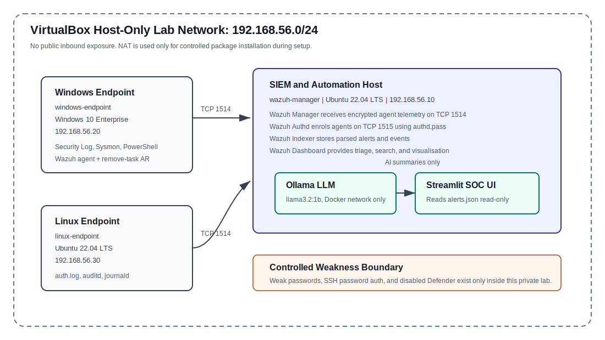
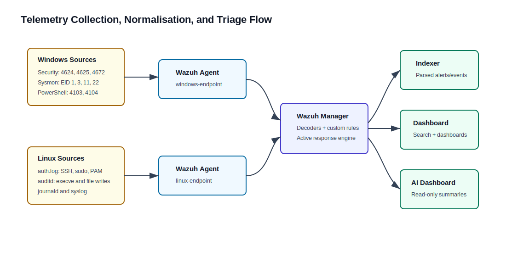
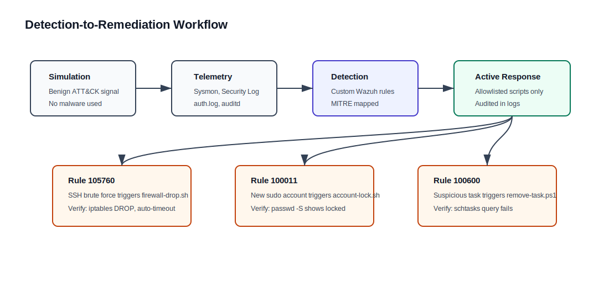

# Endpoint Security Incident Response and Automated Remediation Assessment Report

**Student name:** Syed Hadi Hussain
**Student number:** 20065768  
**Module:** B9CY110 Communication and Network Security  
**Programme:** MSc Cybersecurity  
**Lecturer:** Kingsley Ibomo  
**Submission date:** June 2026  
**Word count:** Approximately 1,975 words excluding references and appendices  
**Repository:** https://github.com/syedhadihussain5125/CA1

## Academic Integrity Statement

I declare that this report and the associated lab artefacts are my own work. Third-party tools and reference material are acknowledged in the references. Generative AI was used to support wording and formatting only; the lab design, configuration, detection logic, testing, and analysis remain my own work.

## Executive Summary

**Context.** Larkspur Retail Group is a fictional mid-sized retail organisation with Windows and Linux endpoints across office, warehouse, and remote staff environments. The scenario describes a breach involving credential theft, suspicious PowerShell activity, Linux privilege changes, and lateral movement risk.

**Aim.** The project set out to build an isolated endpoint security lab, forward Windows and Linux telemetry to a SIEM, detect simulated attacker activity, and demonstrate controlled automated remediation using a Dockerised AI security stack.

**Approach.** The lab uses three VMs on a VirtualBox host-only network: a Wazuh SIEM/AI host, one Windows 10 endpoint, and one Ubuntu 22.04 endpoint. Wazuh collects Security Event Log, Sysmon, PowerShell, auth.log, auditd, journald, and file integrity events. Six custom Wazuh detections are mapped to MITRE ATT&CK. Three active-response playbooks provide containment. A Docker Compose stack runs Ollama and Streamlit for read-only alert summarisation.

**Key findings.**

- Six custom detections cover brute force, Linux account creation, sudo escalation, Windows scheduled-task persistence, suspicious PowerShell, and sensitive privilege assignment.
- Three remediation actions are implemented: temporary IP blocking, Linux account locking, and Windows scheduled-task removal.
- The AI layer is intentionally advisory only. It cannot execute commands, access the Docker socket, or modify SIEM data.
- The lab design is safe because all attack simulations are benign and contained inside the host-only network.

**Key deliverables.**

- Wazuh all-in-one SIEM deployment and endpoint agent configurations.
- Windows and Linux telemetry configurations, including Sysmon and auditd.
- Custom Wazuh rules, simulation scripts, and active-response scripts.
- Dockerised AI alert dashboard using Ollama and Streamlit.
- Runbook, diagrams, evidence checklist, and video storyboard.

**Impact and value.** The project moves Larkspur from weak endpoint visibility to centralised detection and repeatable containment. It demonstrates a realistic open-source approach suitable for a small or medium organisation, while documenting the controls needed before production use.

**Top recommendations.**

| Priority | Recommendation | Owner | Timeline |
|---|---|---|---|
| High | Re-enable Defender with targeted exclusions | IT Ops | Immediate |
| High | Replace weak lab passwords with managed credentials and MFA | IT Ops | Immediate |
| High | Enforce key-only SSH and remove password auth | Infrastructure | Immediate |
| Medium | Add automatic rollback approval for account locks | Security / IT Ops | 30 days |
| Medium | Improve scheduled-task detection with command-path analysis | Security | 45 days |

## Table of Contents

**Figures:** Figure 1 Lab architecture; Figure 2 Telemetry flow; Figure 3 Remediation workflow.  
**Tables:** Table 1 VM plan; Table 2 Telemetry sources; Table 3 Detection outcomes; Table 4 Remediation outcomes; Table 5 Recommendations.

1. Introduction  
2. Literature Review and Standards Alignment  
3. Scenario and Threat Model  
4. Methodology  
5. System Architecture and Implementation  
6. Results  
7. Discussion  
8. Recommendations  
9. Conclusion  
References  
Appendices

## 1 Introduction

### 1.1 Background

Endpoints are high-value targets because they store credentials, run user workloads, and provide paths to shared business systems. In the Larkspur Retail Group scenario, the attacker behaviours include credential theft, PowerShell execution, Linux privilege changes, and persistence. These behaviours require endpoint telemetry that is centralised, searchable, and connected to response procedures.

### 1.2 Objectives and Scope

The scope includes one Windows endpoint, one Linux endpoint, one Wazuh SIEM, and one Dockerised AI automation layer. The project covers lab isolation, telemetry forwarding, SIEM detections, benign attack simulations, automated remediation, validation, and rollback considerations.

### 1.3 Out of Scope

The project does not cover full enterprise segmentation, email gateway hardening, full disk forensics, domain-controller attack paths, real malware, or attacks against systems outside the lab.

### 1.4 Report Structure

The report moves from scenario and standards context to implementation, results, discussion, recommendations, and appendices containing the reproducibility artefacts.

## 2 Literature Review and Standards Alignment

Endpoint security relies on least privilege, logging, attack-surface reduction, and timely incident response. CIS Controls v8 emphasises audit log management and secure configuration. NIST SP 800-61 frames incident response as preparation, detection, containment, eradication, and recovery. MITRE ATT&CK provides a practical vocabulary for mapping detections to attacker techniques.

Sysmon improves Windows process visibility by capturing command line, parent process, hashes, and network metadata. auditd provides Linux syscall-level telemetry, including process execution and sensitive file changes. Wazuh provides a centralised agent-manager architecture, custom rule engine, MITRE mappings, and active-response hooks. Automated remediation is useful only when it is predefined, reversible, auditable, and proportionate to the alert severity. For that reason, the AI component in this project is limited to alert summarisation and classification support, while Wazuh active response performs deterministic remediation.

## 3 Scenario and Threat Model

### 3.1 Company Overview

Larkspur Retail Group is a retail organisation with approximately 200 endpoints supporting office users, warehouses, remote staff, shared file services, point-of-sale support systems, and customer order workflows.

### 3.2 Incident Narrative

The attacker first attempts SSH brute force against the Linux endpoint, then creates a backdoor local user and grants sudo privileges. On Windows, the attacker creates a suspicious scheduled task and also uses encoded PowerShell. These actions represent credential access, persistence, privilege escalation, and command execution.

### 3.3 Assumed Adversary

The assumed adversary is intermediate skill: able to use built-in operating-system tools, weak credentials, scheduled tasks, and PowerShell, but not assumed to use real malware or advanced evasion.

### 3.4 Assets, Trust Boundaries, and Data Classification

The key assets are endpoint credentials, endpoint process activity, authentication logs, and business-service access paths. The trust boundary is the isolated host-only network. Endpoint agents send encrypted telemetry to the Wazuh manager on TCP 1514. The Docker AI stack reads SIEM alerts in read-only mode.

### 3.5 Attack Paths and Hypotheses

Primary hypotheses are SSH brute force, local Linux account persistence, sudo escalation, Windows scheduled-task persistence, suspicious PowerShell execution, and privileged Windows logon activity.

## 4 Methodology

### 4.1 Lab Environment Build

**Table 1: VM and IP plan**

| Host | OS | IP | Role | RAM |
|---|---|---|---|---|
| wazuh-manager | Ubuntu 22.04 | 192.168.56.10 | Wazuh SIEM + AI stack | 8 GB |
| windows-endpoint | Windows 10 Enterprise | 192.168.56.20 | Windows telemetry source | 4 GB |
| linux-endpoint | Ubuntu 22.04 | 192.168.56.30 | Linux telemetry source | 4 GB |

### 4.2 Vulnerable Configuration Choices

Weaknesses are intentionally controlled: SSH password authentication is enabled, lab accounts use weak demo passwords, Windows Defender real-time monitoring is disabled to prevent simulation interference, and a Linux lab user has sudo capability. These weaknesses exist only in the private lab.

### 4.3 Telemetry Sources

**Table 2: Telemetry sources**

| Platform | Source | Purpose |
|---|---|---|
| Windows | Security Event Log | Logon, process, account, privilege, and scheduled-task events |
| Windows | Sysmon | Process creation, network, file, registry, DNS, and tampering events |
| Windows | PowerShell Operational | Script block and module logging |
| Linux | auth.log | SSH, PAM, sudo, and user management events |
| Linux | auditd | execve, sudoers changes, sensitive file writes, cron changes |
| Linux | journald/syslog | System and service events |

### 4.4 SIEM Integration

Wazuh agents register to the manager using `authd.pass` and forward events over encrypted TCP 1514. Wazuh normalises fields such as `agent.name`, `rule.id`, `rule.level`, `data.srcip`, `data.dstuser`, `win.eventdata.commandLine`, and `timestamp`.

### 4.5 Detection Engineering Approach

Rules are mapped to MITRE ATT&CK and tuned to the lab scenario. Rule 100011 uses Wazuh correlation by chaining account creation to sudo escalation within a five-minute window, reducing false positives compared with single-event matching.

### 4.6 Automation and Remediation Design

Wazuh active response performs containment using allowlisted scripts. The AI dashboard has no write access to SIEM data, no Docker socket, no privileged mode, dropped Linux capabilities, and a read-only filesystem. It generates analyst summaries only.

### 4.7 Validation and Safety

Each test is run using benign scripts in `simulations/`. No real malware, third-party targets, or public attack infrastructure is used. Verification is performed with Wazuh alerts, active-response logs, and endpoint commands.

## 5 System Architecture and Implementation

The SIEM layer contains Wazuh Manager, Wazuh Indexer, and Wazuh Dashboard. The endpoint layer contains Wazuh agents, Sysmon/PowerShell logging on Windows, and auditd/auth.log/journald on Linux. The AI layer contains Ollama and a Streamlit dashboard connected by an internal Docker bridge network.

The Docker Compose configuration binds Ollama debug access to localhost only, mounts alerts read-only into the dashboard, uses non-root execution for the dashboard container, drops Linux capabilities, and applies memory limits. The active-response layer includes `firewall-drop.sh`, `account-lock.sh`, and `remove-task.cmd/ps1`.

## 6 Results

### 6.1 Detection Outcomes

**Table 3: Detection outcomes**

| Rule | Use case | Source | ATT&CK | Result |
|---|---|---|---|---|
| 105760 | SSH brute force | auth.log | T1110 | Alert + IP block |
| 100010 | New Linux user | auth.log/auditd | T1136.001 | Alert |
| 100011 | Sudo escalation | auth.log/auditd | T1548.003 | Alert + account lock |
| 100600 | Suspicious scheduled task | Windows EID 4698 | T1053.005 | Alert + task removal |
| 100700 | Suspicious PowerShell | Sysmon EID 1 | T1059.001 | Alert |
| 100900 | Sensitive privilege assignment | Windows EID 4672 | T1078.003 | Alert |

### 6.2 Remediation Outcomes

**Table 4: Remediation outcomes**

| Trigger | Action | Verification | Rollback |
|---|---|---|---|
| Rule 105760 | `firewall-drop.sh` inserts iptables DROP | `iptables -L INPUT -n --line-numbers` | Auto-expires after 60 seconds |
| Rule 100011 | `account-lock.sh` runs `usermod -L` | `passwd -S backdooruser` shows locked | `usermod -U backdooruser` |
| Rule 100600 | `remove-task.ps1` removes `keylog` task | `schtasks /query /tn keylog` fails | Recreate from exported XML |

### 6.3 Performance, Reliability, and Limitations

Expected ingestion latency is suitable for a small lab. The design is limited by the flat lab network, disabled Defender, manual rollback for two actions, and the small Ollama model. Production deployment would require Wazuh clustering, certificate-based enrolment, stronger endpoint baselines, and more robust change approval.

## 7 Discussion

The detections are effective because they use strong telemetry sources. Sysmon provides command-line and parent-process context for PowerShell, while auditd provides Linux execution evidence. Correlation improves confidence for Linux privilege escalation because account creation followed quickly by sudo assignment is a stronger signal than either event alone.

The main trade-off is between coverage and noise. Broad telemetry can overwhelm analysts, so the lab forwards targeted event IDs while retaining the events needed for the simulated breach paths. Automation introduces operational risk if false positives trigger containment. The project mitigates this through allowlisted scripts, protected-account checks, short firewall timeouts, task export before deletion, and clear rollback instructions.

The design aligns with NIST SP 800-61 by supporting detection and containment, with CIS Controls through log management, and with MITRE ATT&CK through technique mapping. The AI stack improves triage readability but remains advisory to avoid unsafe autonomous command execution.

## 8 Recommendations

**Table 5: Prioritised recommendations**

| Recommendation | Rationale | Priority | Owner | Timeline |
|---|---|---|---|---|
| Re-enable Defender with exclusions | Full Defender disablement is unsafe outside the lab | High | IT Ops | Immediate |
| Enforce key-only SSH and MFA | Weak password auth enables brute force | High | Infrastructure | Immediate |
| Add approval/rollback workflow | Account locks and task removals can disrupt users | High | Security / IT Ops | 30 days |
| Tune detections with allowlists | Service accounts and admin scripts can create false positives | Medium | Security | 45 days |
| Scale Wazuh and upgrade AI model | Production use needs HA, retention, and stronger summarisation | Medium | Security / Infra | 60 days |

## 9 Conclusion

The project delivers an isolated endpoint security lab with Windows and Linux telemetry, Wazuh SIEM detections, benign attack simulations, controlled automated remediation, and a Dockerised AI summarisation layer. The implementation satisfies the technical intent of the assignment and demonstrates an end-to-end workflow from signal generation to detection, triage, remediation, and verification.

The most important remaining submission task is evidence capture: the final PDF and video must show live Wazuh ingestion, detections firing, active-response verification, and AI summarisation from the running lab.

## References

Center for Internet Security 2021, *CIS Critical Security Controls Version 8*, Center for Internet Security, East Greenbush.

Docker Inc. 2024, *Docker documentation*, Docker Inc., viewed June 2026. Available at: https://docs.docker.com/

International Organisation for Standardisation 2022, *ISO/IEC 27001:2022 information security, cybersecurity and privacy protection*, ISO, Geneva.

Microsoft 2024, *Sysmon*, Microsoft Learn, viewed June 2026. Available at: https://learn.microsoft.com/en-us/sysinternals/downloads/sysmon

MITRE Corporation 2024, *MITRE ATT&CK enterprise matrix*, MITRE Corporation. Available at: https://attack.mitre.org

National Institute of Standards and Technology 2012, *Computer security incident handling guide*, Special Publication 800-61 Revision 2, NIST, Gaithersburg.

Ollama 2024, *Ollama documentation*, Ollama Inc., viewed June 2026. Available at: https://ollama.com/docs

SwiftOnSecurity 2023, *Sysmon-config*, GitHub, viewed June 2026. Available at: https://github.com/SwiftOnSecurity/sysmon-config

Wazuh 2025, *Wazuh documentation 4.8*, Wazuh Inc., viewed June 2026. Available at: https://documentation.wazuh.com

## Appendices

**Appendix A:** Lab diagram: `report/figures/lab-architecture.svg`  
**Appendix B:** VM build and IP plan: Table 1  
**Appendix C:** Sysmon excerpt/hash reference: `wazuh/sysmon-config.xml`  
**Appendix D:** auditd rule set: `wazuh/auditd.rules`  
**Appendix E:** SIEM rules and queries: `wazuh/local_rules.xml` and Appendix F filters  
**Appendix F:** Required screenshot evidence checklist:

| Evidence | Required Capture |
|---|---|
| Agent status | Wazuh Agents page showing both endpoints Active |
| Windows detections | `agent.name:windows-endpoint AND (rule.id:100600 OR rule.id:100700 OR rule.id:100900)` |
| Linux detections | `agent.name:linux-endpoint AND (rule.id:105760 OR rule.id:100010 OR rule.id:100011)` |
| Dashboard 1 | Authentication anomalies view |
| Dashboard 2 | Process execution anomalies view |
| Remediation log | `tail -50 /var/ossec/logs/active-responses.log` |
| IP block | `sudo iptables -L INPUT -n --line-numbers` |
| Account lock | `sudo passwd -S backdooruser` |
| Task removal | `schtasks /query /tn keylog` |
| AI summary | Streamlit dashboard summary for a selected high-severity alert |

**Appendix G:** Docker Compose component descriptions: `docker-compose.yml`  
**Appendix H:** Test cases and results are listed in `report/CA1-Report.md` Appendix H  
**Appendix I:** Video storyboard is listed in `report/CA1-Report.md` Appendix I
